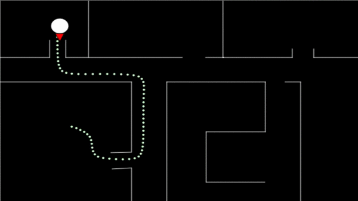

# Robot JS

This project simulates an environment for a Robot, using Localization, Path Planning, and Controller. The following topics were based on the free course of Udacity <a href="https://classroom.udacity.com/courses/cs373">Artificial Intelligence for Robotics</a>

* Particle filter
* A* 
* Smooth path
* PID controller

In order to simulate the sensors I used Raycasting, based in the Daniel Shiffman <a href="https://www.youtube.com/watch?v=TOEi6T2mtHo&t=709s">Youtube Video</a>

## Demonstration

### Demo Page

https://matheuslrsouza.github.io/particle-filter-js/

### Non debug

### Debug

* Green cells are the walls in the grid
* Blue are the expanded cells in A* algorithm in order to search the optimal path
* Magenta is the path finded in the A*
* White dots are the Smoothed Path

### Particle Filter

The green circle is the belief of where the robot is, the motion is done based in that belief